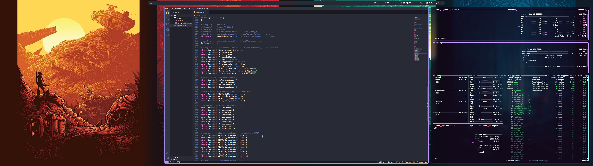

# My dotfiles



You obviously won't be able to use these directly. I have a 5120x1440 screen, so if you do you'll have
issues. That said you can edit it and get it close to what you need.

I'm running nvidia, so you'll need to change the gpu stuff if you're not. But this does work pretty smoothly for me.

1. You will need the following packages. Some are from AUR.

full-dracula-theme-git
flat-remix-gtk
lxappearance (to set the gtk theme)
xdg-desktop-portal
xdg-desktop-portal-gtk 
xdg-desktop-portal-hyprland 
wofi
wlr-randr
swww
swayidle
swaylock
starship (optional, remove from .zshrc)
nvidia-dkms 
nvidia-settings 
nvidia-utils 
gdm (you might be able to use a different DM but I couldnt)
libva-nvidia-driver
libva
hyprland
grim
slurp
gnome-keyring (or the kde equivalent)
zsh
kitty

There's probably something I missed.

```sh
yay -S full-dracula-theme-git flat-remix-gtk lxappearance xdg-desktop-portal xdg-desktop-portal-gtk xdg-desktop-portal-hyprland wofi wlr-randr swww swayidle swaylock starship nvidia-dkms  nvidia-settings nvidia-utils libva-nvidia-driver libva hyprland grim slurp zsh kitty
```

gnome deps

```sh
yay -S gnome-keyring gdm
```

all the nvidia packages I have

```sh
local/egl-wayland 2:1.1.13-1
    EGLStream-based Wayland external platform
local/lib32-nvidia-utils 550.54.14-1
    NVIDIA drivers utilities (32-bit)
local/libva-nvidia-driver 0.0.11-1
    VA-API implementation that uses NVDEC as a backend
local/libvdpau 1.5-2
    Nvidia VDPAU library
local/libxnvctrl 550.54.14-1
    NVIDIA NV-CONTROL X extension
local/nvidia-dkms 550.54.14-4
    NVIDIA drivers - module sources
local/nvidia-settings 550.54.14-1
    Tool for configuring the NVIDIA graphics driver
local/nvidia-utils 550.54.14-4
    NVIDIA drivers utilities
```

2. oh-my-zsh installed using the usual method.

3. You will also need all the nerd fonts installed somehow. Or at least the ones I use. I install them all.

4. grub config in /etc/default/grub

```sh
GRUB_CMDLINE_LINUX_DEFAULT="loglevel=3 nvidia-drm.modeset=1 acpi_osi=! acpi_osi='Windows 2015' nvidia.NVreg_PreserveVideoMemoryAllocations=1"
```

5. The xdg-desktop-portal package seems important. It fixed lag in multiple apps for me. I'm not sure if it's necessary but it's in my config.

6. I looked heavily at https://wiki.archlinux.org/title/NVIDIA/Tips_and_tricks. Point 10 seems to be important. I did all that.